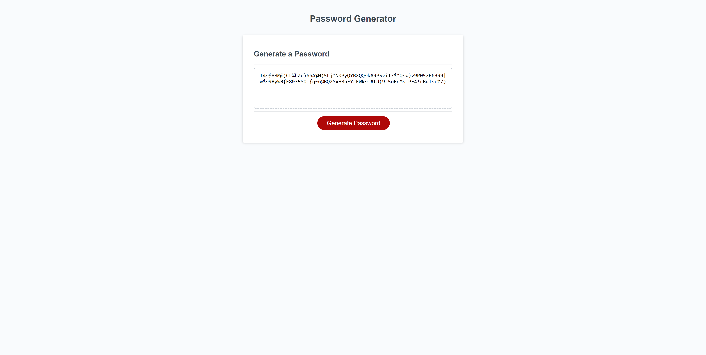

# Password Generator for Javascript

## The homework for Week 3 of the coding bootcamp is to create a random password generator with Javascript

## Functionality 

- Generates a random password between 8 and 128 characters long
- Gives user freedom to choose what characters are or are not used in the password between numbers, symbols, uppercase and lowercase letters

## The Code

- Using a while loop, the code makes sure that valid data is being entered
- Using multiple if statements, the code checks which characters the user wants, each answer corresponding to an array
- Using the .push() method, the code creates an array labeled 'options' 
- Using a for loop, the code pulls from the newly created options array to generate a random and secure password.
- Using a querySelector, the code returns the newly generated password to the viewport. 

 

# Screenshot of the Project in Action

## Link to Deployed URL

Below is the URL to the deployed application. 

https://damien-shoemake.github.io/javascript-password-generator/